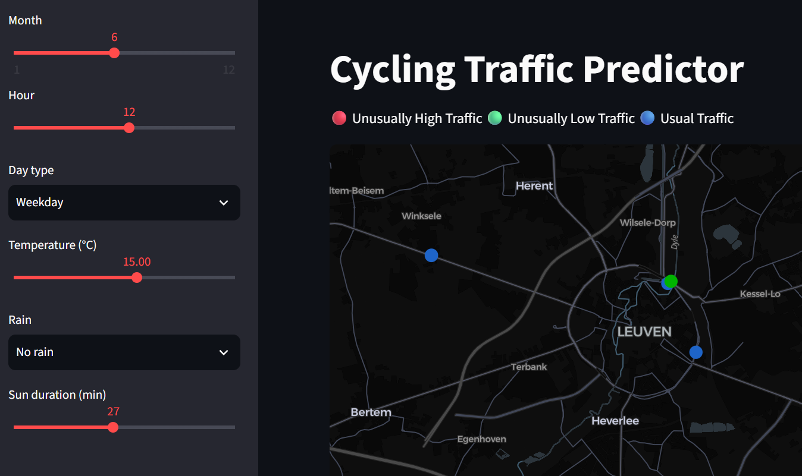

# Predicting Cycling Traffic in Flanders

> Predicting hourly cycling volumes using temporal, weather, and spatial features.

A collaborative project developed for the **Modern Data Analytics course at KU Leuven**. This repository presents the project and highlights my contributions to **data preparation, feature engineering, and LightGBM model testing**.

| Cycling Traffic Prediction Dashboard |
| :---: |
|  |

Explore predicted hourly cycling traffic under different weather and time conditions. Click the image to open the interactive dashboard.

---

## Project Overview

Understanding how cycling traffic changes across locations, seasons, and weather conditions can support mobility planning.

Our team combined cycling counts, meteorological observations, and public transport information to predict hourly bicycle passages across Flanders. We developed a **LightGBM model with a Poisson objective** and an interactive dashboard for exploring predictions under different scenarios.

### Research Question

To what extent can cycling traffic volumes across Flanders be predicted using temporal, meteorological, and spatial features?

---

## My Contributions

My main responsibility was preparing the data for modelling. I also supported the team's machine learning experiments.

### Data Cleaning and Preparation

- Cleaned and processed raw data into a consistent, model-ready format.
- Standardised variable types and date/time formats for processing and merging.
- Handled missing observations during data preparation.

### Feature Engineering

- Transformed variables into suitable inputs for predictive modelling.
- Created cyclical representations of time variables using sine and cosine transformations.
- Prepared features to represent recurring hourly and seasonal patterns.

Cyclical encoding captures relationships such as the proximity of 23:00 to 00:00 and December to January.

### LightGBM Testing

- Helped test the LightGBM model with different hyperparameter settings.
- Compared model performance across experiments.
- Supported checks of model generalisation and overfitting.

The broader analysis and dashboard were developed collaboratively by the team.

---

## Dataset

| Source | Information |
| --- | --- |
| Agentschap Wegen en Verkeer (AWV) | Cycling counts and counting-site locations |
| Royal Meteorological Institute of Belgium | Temperature, rainfall, and sunshine observations |
| De Lijn | Public transport stop locations |

| Prepared dataset | Observations |
| --- | ---: |
| 2024 | 1,200,616 |
| 2025 | 1,237,175 |

**Prediction target:** Bicycle passages per counting site per hour.

The original 15-minute counts were aggregated into hourly observations, combining both travel directions.

---

## Data Preparation Workflow

The team's workflow included:

1. **Combining cycling records**  
   Merged monthly datasets and retained cyclist counts.

2. **Aggregating observations**  
   Converted 15-minute records into hourly counts.

3. **Preparing temporal features**  
   Extracted hour, month, season, and weekday/weekend information.

4. **Integrating weather data**  
   Matched cycling sites to nearby weather stations and used alternative nearby stations when observations were missing.

5. **Adding public transport features**  
   Calculated the number and proximity of public transport stops within one kilometre of each counting site.

6. **Encoding model inputs**  
   Created cyclical time features and prepared categorical variables for LightGBM.

---

## Modelling Approach

We used **LightGBM with a Poisson objective** to model non-negative cycling counts and capture nonlinear relationships between predictors.

### Training and Evaluation

- **Training data:** 2024 observations.
- **Validation data:** 20% of the 2025 observations.
- **Test data:** The remaining 80% of the 2025 observations.
- **Evaluation metric:** Mean Poisson deviance.
- **Baseline:** A constant prediction equal to the training-set mean.

The validation and test subsets were created by randomly splitting the 2025 data.

### Model Experiments

The team explored settings including:

- Learning rate.
- Number of leaves.
- Feature fraction.
- Minimum observations per leaf.
- Number of boosting rounds.
- Bagging.

---

## Main Findings

- LightGBM achieved substantially lower Poisson deviance than the constant-mean baseline.
- Time of day and counting-site identity were prominent predictors.
- Temperature contributed to predictions.
- Public transport features had relatively low importance in the reported SHAP analysis.
- Feature rankings differed between split-based importance and SHAP, reflecting the different quantities these methods measure.

These findings describe predictive relationships and do not establish causal effects.

---

## Interactive Dashboard

The team developed a dashboard using **Streamlit and PyDeck** to explore predicted cycling traffic across the monitoring network.

Users can adjust:

- Month and hour.
- Weekday or weekend.
- Temperature.
- Rainfall.
- Sunshine duration.

The dashboard displays station-level predictions on a map and compares the selected scenario with a reference scenario.

[Open the dashboard](https://mda-course-dashboard.streamlit.app/)

---

## Technology Stack

| Area | Tools |
| --- | --- |
| Data preparation | Python, pandas, NumPy |
| Machine learning | LightGBM |
| Model evaluation | scikit-learn |
| Model interpretation | SHAP |
| Dashboard | Streamlit, PyDeck |
| Collaboration | GitHub |

---

## Limitations and Future Improvements

- **Evaluation design:** The report describes selecting boosting rounds using test performance. Future experiments should tune exclusively on validation data and reserve an untouched test period for final evaluation.
- **Metric reconciliation:** The report contains two different test-deviance values, so an exact final score is not presented here.
- **New locations:** Reliance on site identity may limit performance at previously unseen counting stations.
- **Unusual conditions:** Predictions may be less reliable for extreme weather or scenarios poorly represented in the training data.
- **Additional features:** School holidays, roadworks, public events, and socioeconomic information could enrich the analysis.

Potential workflow improvements include automated data ingestion and systematic experiment tracking.

---

## Team and Acknowledgements

This project was completed by:

- Junior Anyakudo
- Anastasia De Bondt
- Darya Lukashina
- Yea Sung Kim

**KU Leuven · Modern Data Analytics · Group 18 · May 2026**

The analysis, results, and dashboard are collaborative outputs. This repository provides my personal presentation of the project and identifies my own contributions.

### Project Links

- [Project repository shared for this portfolio](https://github.com/yeasung240/Modern_data_analysis)
- [Code repository listed in the team report](https://github.com/DayaLuna/MDA_course)
- [Interactive dashboard](https://mda-course-dashboard.streamlit.app/)
